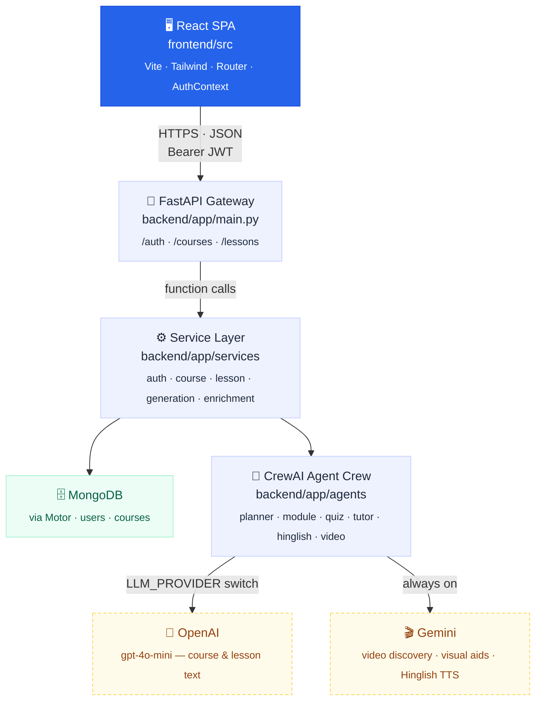

# 📚 Learnify AI

**Turn a single prompt into a full, structured course** — modules, lessons, videos, an AI tutor, and quizzes that track real progress.

---

## ✨ Features

| | |
|---|---|
| 🧠 **AI-generated courses** | Describe any topic and a crew of AI agents plans modules and writes lessons for you |
| 🎥 **Rich lessons** | Every lesson is auto-enriched with embedded videos and visual aids |
| 💬 **AI tutor** | Ask questions about any lesson and get contextual answers on demand |
| 🇮🇳 **Hinglish mode** | Get lesson explanations in Hinglish for easier understanding |
| ✅ **Module quizzes** | Each module unlocks a quiz once its lessons are complete — pass at ≥70% |
| 📊 **Real progress tracking** | Blended lesson + quiz completion, tracked per course and per module |
| 🔐 **Auth built-in** | JWT-based signup/login — courses are private to your account |

---

## 🏗️ Tech Stack

**Frontend** — React 19 · React Router · Tailwind CSS 4 · Framer Motion · Vite

**Backend** — FastAPI · Motor (async MongoDB) · CrewAI · Pydantic

**LLMs** — OpenAI or Gemini (configurable) for course/lesson generation · Gemini for video discovery & Hinglish narration

**Database** — MongoDB
Email: demo@learnify.ai
Password: demo1234
---

## 🏛️ Architecture 




*Dashed nodes leave our infrastructure and call third-party APIs.*

---

## 🚀 Getting Started

### 1. Start MongoDB

```bash
docker compose up -d
```

### 2. Backend

```bash
cd backend
python -m venv .venv && .venv/Scripts/activate   # or source .venv/bin/activate
pip install -r requirements.txt
cp .env.example .env   # fill in GEMINI_API_KEY / OPENAI_API_KEY / JWT_SECRET
python -m uvicorn app.main:app --reload --port 8000
```

### 3. Frontend

```bash
cd frontend
npm install
npm run dev
```

Open **http://localhost:5173** 🎉

---

## 📁 Project Structure

```
backend/
  app/
    agents/      # CrewAI agents — course planning, lessons, quizzes, tutor, videos
    routes/       # FastAPI endpoints (auth, courses, lessons)
    services/     # Business logic + MongoDB access
    models/       # Pydantic schemas
frontend/
  src/
    pages/        # Route-level views (Home, Course, Lesson, Login, Signup...)
    components/   # Reusable UI (Sidebar, QuizPanel, panels, blocks...)
    context/       # Auth context
    utils/        # API client, progress calculations
```

---

## 🔑 Environment Variables

See [`backend/.env.example`](backend/.env.example) — requires a `GEMINI_API_KEY` at minimum, plus `OPENAI_API_KEY` if using OpenAI for course generation (`LLM_PROVIDER=openai`, the default). Additional `GEMINI_API_KEY_1`, `_2`, … are auto-discovered and rotated through on quota/rate-limit errors — see `backend/app/agents/gemini_keys.py`.

Renaming from "Text-to-Learn" changed the *default* `MONGO_DB_NAME` (now `learnify_ai`) — this only affects fresh `.env` files copied from `.env.example`. If your local `.env` already pins an explicit `MONGO_DB_NAME`, it keeps pointing at that database; nothing migrates automatically.

---

## 🚀 Deployment

Full guide, required env vars, and a post-deploy checklist: **[DEPLOYMENT.md](DEPLOYMENT.md)**.

Target: Vercel (frontend) · Render (backend) · MongoDB Atlas (database) — no other managed infrastructure required.

---

## 💾 Backup & Restore

MongoDB runs in the `mongo` compose service — these scripts shell out to `docker compose exec mongo ...`, so no host-installed Mongo tools are required.

```bash
# Full backup: a BSON dump (dump.archive) plus a JSON export per collection
scripts/export_mongo.sh
# → writes to backups/<timestamp>/ by default, or pass a custom output dir

# Restore from a backup directory (drops existing collections first)
scripts/restore_mongo.sh backups/20260704-101500
```

Every logged-in user can also export just their own data (courses, lessons, video notes) as JSON via the account menu → **Export my data**, or directly: `GET /api/auth/me/export`.
