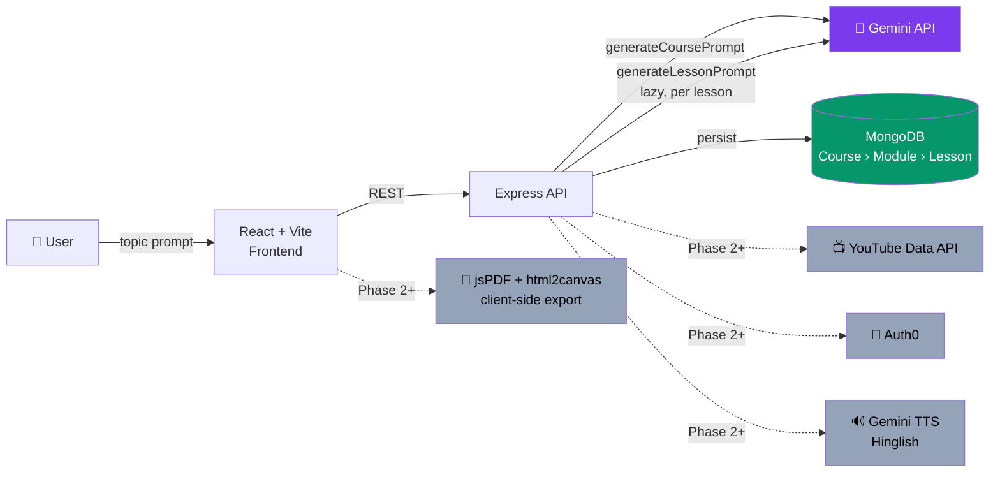
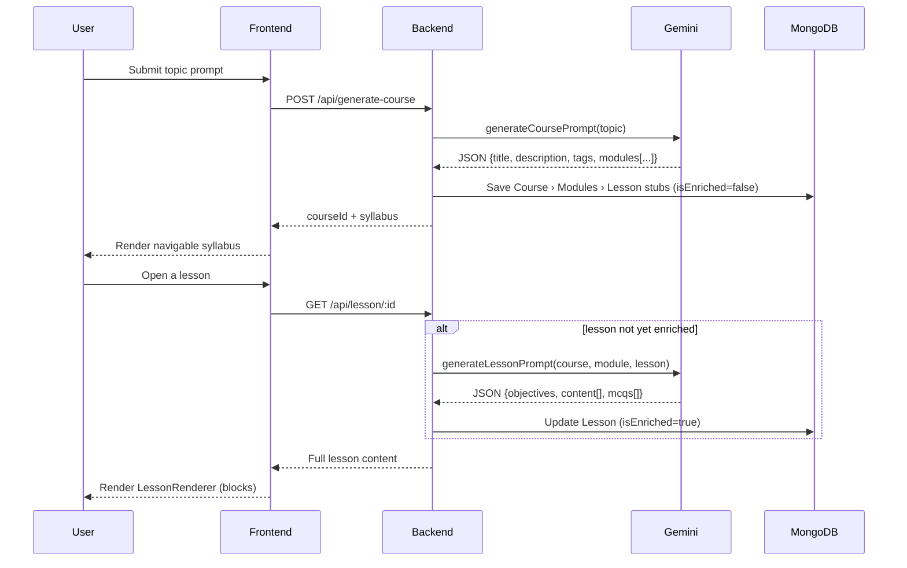
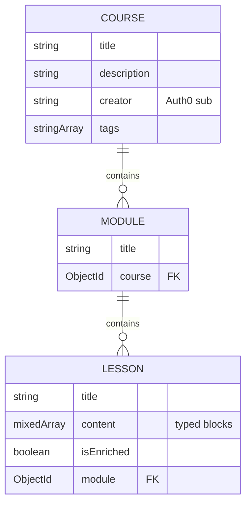

# 📚 Text-to-Learn — AI-Powered Course Generator

> Turn a topic prompt into a complete, structured online course — generated by AI, persisted, and rendered as a navigable syllabus.

**Status:** Requirements aligned · Pre-implementation
**Scope strategy:** MVP first, enhancements layered on after

---

## 1. Elevator Pitch

A user types a topic (*"Intro to React Hooks"*) → Gemini generates a course outline (modules + lessons) → each lesson is enriched on demand with objectives, content blocks, and MCQs → everything is persisted in MongoDB and rendered as a clean, responsive syllabus + lesson viewer.

Graded on (hackathon rubric): **functionality**, **code quality**, **design/UI**, **creativity**.

---

## 2. System Architecture

*(Grey/dotted nodes = Phase 2+, not built in MVP.)*

---

## 3. Core Generation Flow (two-stage, lazy enrichment)

Lesson content is generated **lazily on first open**, not eagerly with the outline — keeps outline generation fast and avoids wasted tokens on unread lessons.

---

## 4. Data Model

**Content block types** (`Lesson.content[].type`): `heading` · `paragraph` · `code` (only when relevant) · `video` (search query, not a direct link) · `mcq` (4–5 per lesson, with explanations)

---

## 5. Tech Stack

| Layer | Choice | Notes |
|---|---|---|
| **Frontend framework** | React + Vite | Fast dev/build tooling |
| **Styling** | Tailwind CSS | Utility-first, easy dark-mode for PDF export |
| **Routing** | React Router v6 | `/`, `/course/:id`, `/lesson/:id` |
| **State management** | Context API | Zustand only if state complexity grows |
| **Backend framework** | Node.js + Express | `routes / controllers / middlewares / models / services / utils / config` |
| **Database** | MongoDB + Mongoose | Course → Module → Lesson hierarchy |
| **AI provider** | **Google Gemini** (sole provider) | Course/lesson JSON generation **and** Hinglish translation + TTS |
| **Auth** *(Phase 2+)* | Auth0 (OAuth2) | JWT verification middleware; protects `/api/save-course`, `/api/user-courses` |
| **Video** *(Phase 2+)* | YouTube Data API v3 | Backend resolves AI's search query → embeddable video |
| **PDF export** *(Phase 2+)* | jsPDF + html2canvas | Hidden PDF-styled render target, theme-independent |
| **Hosting — backend** *(Phase 2+)* | Render | `/server` root, env vars for all secrets |
| **Hosting — frontend** *(Phase 2+)* | Vercel | `/client` root, `VITE_API_URL` points at Render |
| **CI/CD** *(Phase 2+)* | GitHub Actions | Build/test/deploy on push, feature-branch + PR workflow |

**Secrets required** (env vars, none committed): `MONGO_URI`, `GEMINI_API_KEY`, `AUTH0_ISSUER`, `AUTH0_AUDIENCE`, `YOUTUBE_API_KEY` — none exist yet; setup guidance needed before Phase 2+.

---

## 6. Requirements

### MVP (Phase 1)
| # | Requirement |
|---|---|
| F1 | Accept free-form topic prompt |
| F2 | Gemini generates course outline: title, description, tags, 3–6 modules × 3–5 lessons |
| F3 | Lazy per-lesson generation: objectives + typed content blocks |
| F4 | 4–5 MCQs per lesson, each with an explanation |
| F5 | Code blocks only when relevant |
| F6 | AI returns raw JSON only — backend validates/parses before persisting |
| F7 | Persist Course › Module › Lesson in MongoDB |
| F8 | Navigable syllabus + lesson viewer, block-type renderer dispatch |
| F9 | Global loading + error states |

### Phase 2+ (post-MVP)
| # | Requirement |
|---|---|
| F10 | Auth0 login/logout, JWT-protected routes, per-user saved courses |
| F11 | YouTube video resolution per lesson |
| F12 | Hinglish translation + TTS (Gemini), `.wav` playback/download |
| F13 | Per-lesson PDF export (module/course export = stretch) |
| F14 | Render + Vercel deployment with CI/CD |

### Non-Functional
- Responsive, clean, evaluated UI
- Modular codebase with clear separation of concerns
- Robust validation around AI-generated JSON (semi-trusted input)
- Token/quota-conscious prompting and caching
- Feature-branch + PR git workflow with meaningful history

### Deliverables
Live public URL · GitHub repo with clear README + commit history · 5-minute demo video (prompt → generation → architecture)

---

## 7. Open Questions

| Topic | Question | Leaning |
|---|---|---|
| Deadline | Is there a hard hackathon submission date? | Unconfirmed |
| Test coverage | Doc mentions CI "test" step but defines no baseline | Establish minimal baseline during planning |
| PDF scope | Lesson-only vs. module/course export | Lesson-only for now |

---

## 8. Planning Recommendations

1. Build Phase 1 as a fully demoable slice — it alone satisfies the grading rubric.
2. Sequence Phase 2+ by credential dependency: Gemini enrichment → YouTube → Auth0 → PDF export (no dependency, could move earlier) → deployment/CI.
3. Nail down the Gemini JSON contracts (`generateCoursePrompt`, `generateLessonPrompt`) and server-side schema validation first — highest-risk integration point.
4. Stand up Mongoose schemas + minimal Express skeleton early — already fully specified, low-risk, unblocks everything else.
