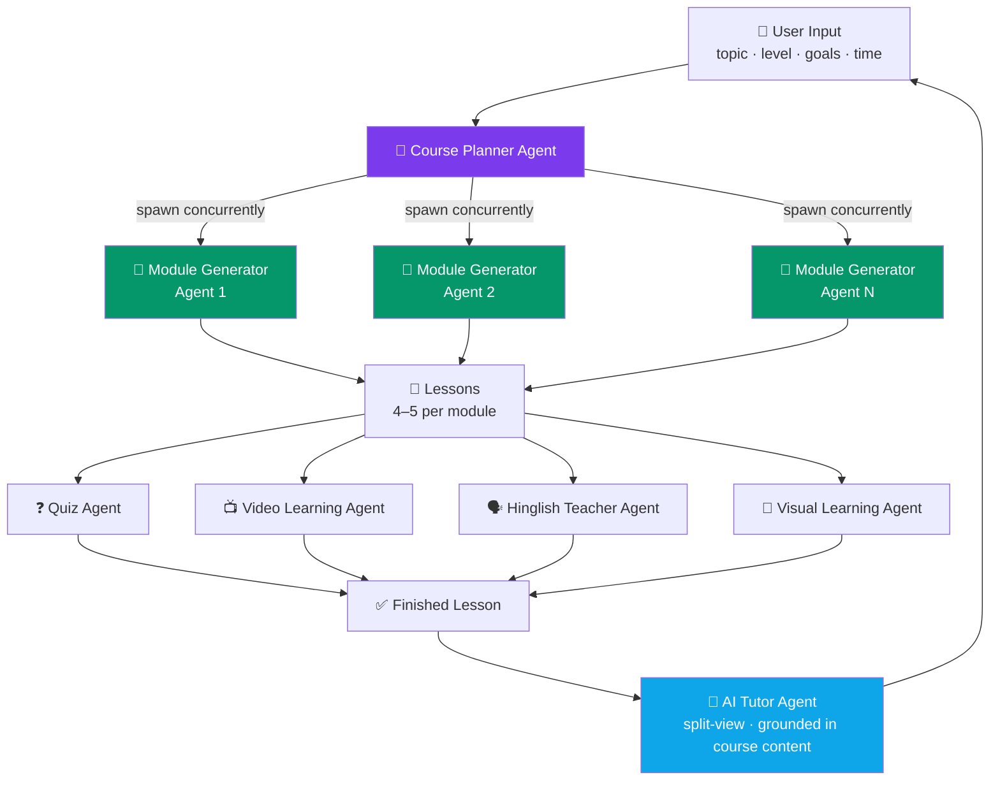
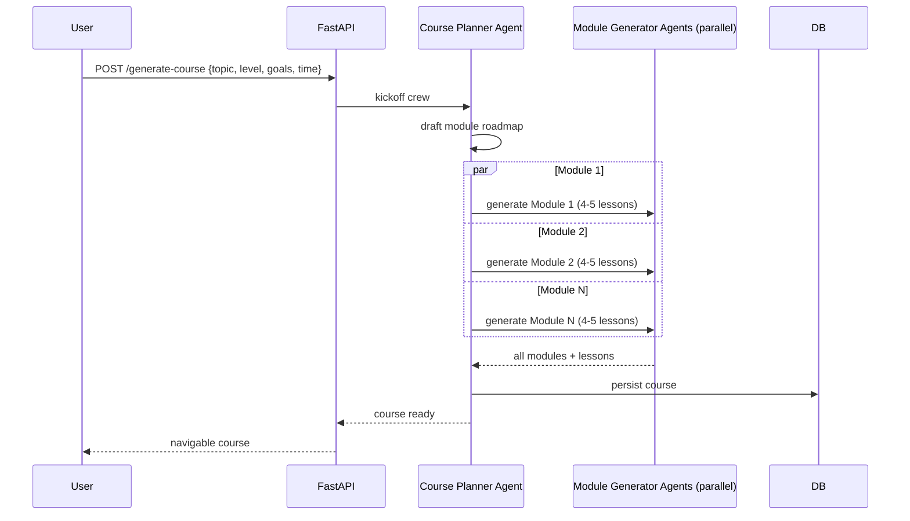
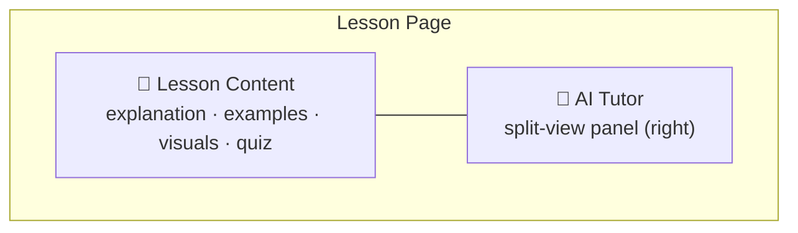
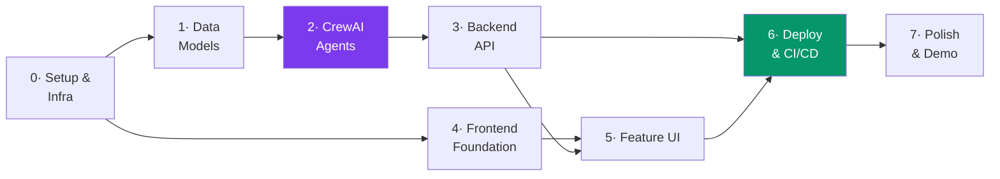

# 🧠 AI Learning Platform — Multi-Agent Architecture Plan

> **Note:** Supersedes the earlier stack in `REQUIREMENTS.md` (Node/Express/Gemini/Render) — this spec moves to **FastAPI + CrewAI**, deployed entirely on **Vercel**.

## Stack

| Layer | Choice |
|---|---|
| Backend | FastAPI (Python) |
| Frontend hosting | Vercel |
| Backend hosting | Render (long-running process — CrewAI runs exceed Vercel/Lambda function timeouts) |
| Database | MongoDB — Docker locally, Atlas (managed, free tier) in production |
| Agent orchestration | CrewAI (multi-agent) |
| LLM provider | **Dual, switchable** — `LLM_PROVIDER=openai` (default) or `gemini`, via `app/agents/llm.py: get_llm()`. Video discovery/notes and Hinglish TTS stay hardcoded to Gemini's raw `google-genai` SDK regardless of this switch (Google Search grounding, native YouTube understanding, and TTS have no OpenAI equivalent) |
| Auth | Custom JWT (`pyjwt` + `bcrypt`) — no third-party provider. Every course/lesson is scoped to its creator |
| UI/UX | Premium, animated, polished — smooth motion, strong typography |

---

## Agent Orchestration

---

## Concurrent Course Generation Flow

*Concurrency across Module Generator Agents is the key lever for cutting total generation time.*

---

## Agent Responsibilities

| Agent | Responsibility |
|---|---|
| **Course Planner** | Builds the roadmap from topic/level/goals/time; spawns Module Generator Agents concurrently |
| **Module Generator** (×N) | One module each — 4–5 lessons with explanations, examples, interactive exercises, takeaways, embedded visuals |
| **Quiz Agent** | End-of-lesson quiz (MCQ / True-False / fill-blank / coding); instant grading, explanations, progress tracking |
| **Video Learning Agent** | 2–3 relevant YouTube videos; on-demand AI notes (summary, key concepts, timestamps, revision notes, takeaways) |
| **Hinglish Teacher Agent** | "Explain in Hinglish" button → simplified Hinglish text + natural audio narration |
| **Visual Learning Agent** | Mind maps, flowcharts, concept maps, process diagrams, timelines, comparison tables |
| **AI Tutor Agent** | Persistent split-view panel; answers grounded in course content, simplifies concepts, real-time doubt resolution |

---

## Lesson Page Layout

---

## Implementation Roadmap

### Phase 0 — Setup & Infrastructure ✅
- [x] Monorepo layout: `/backend` (FastAPI), `/frontend` (React + Vite)
- [x] Python env (venv) + `requirements.txt`: `fastapi`, `uvicorn`, `pydantic`, `motor`, `python-dotenv` (`crewai` added in Phase 2)
- [x] Frontend scaffold: Vite + React + Tailwind + React Router + Framer Motion
- [x] `docker-compose.yml` — local MongoDB container for dev
- [ ] Provision MongoDB Atlas free cluster for production → `MONGO_URI`
- [x] Obtain **Gemini API key** (only external AI key needed — video discovery uses Gemini's Google Search grounding, no YouTube Data API key required)
- [x] `.env.example` for both apps; real `.env` files git-ignored
- [ ] GitHub repo: feature-branch + PR workflow established

### Phase 1 — Data Models & Persistence ✅
- [x] Pydantic models: `CourseGenerateRequest`, `Course`, `ModuleOutline`/`LessonStub`, `Lesson`, `QuizQuestion`, `VideoNote` (`QuizAttempt` deferred — no user accounts yet, quiz grading is stateless for now)
- [x] MongoDB collections: `courses` (embeds module/lesson **outlines** — cheap, always read together for the syllabus) and `lessons` (full detail, written lazily on enrichment; shares its `_id` with the matching lesson stub)
- [x] `backend/app/database.py` — connection/session management
- [x] `backend/app/services/*_service.py` — CRUD layer per entity, verified end-to-end via `backend/scripts/seed_sample_course.py` and the `/api/courses`, `/api/lessons` read routes

### Phase 2 — CrewAI Agent Layer ✅
- [x] Wire CrewAI to **Gemini** as the LLM backend — `app/agents/llm.py`. Note: `gemini-2.0-flash` has **zero free-tier quota** as of mid-2026; standardized on `gemini-2.5-flash`. Confirmed the new `AQ.Ab...` key format works fine with CrewAI/LiteLLM, no compatibility issue. **Superseded in Phase 8**: Gemini's free tier (20 req/day) exhausted too fast for real use, so `get_llm()` now switches between OpenAI (`gpt-4o-mini`, default) and Gemini per the `LLM_PROVIDER` setting — see Phase 8.
- [x] **Course Planner Agent** — `app/agents/course_planner.py`, outputs title/description/tags/module titles via `output_pydantic` (`CourseOutlineSchema`)
- [x] **Module Generator Agents** — `app/agents/module_generator.py`, one per module, run concurrently via `asyncio.gather` + CrewAI's native `kickoff_async` (not a thread-pool workaround). Each produces 4–5 full lessons (objectives + typed content blocks) directly — content is generated eagerly at course-creation time, not lazily on first open, since concurrency across modules keeps total latency reasonable (~44s for a 4-module course in testing)
- [x] Orchestration: `app/services/generation_service.py` ties both agents together and persists Course + Lessons; exposed via `POST /api/courses/generate` (pulled forward from Phase 3 to enable real end-to-end testing)
- [x] Retry wrapper for malformed/transient agent output — `app/agents/retry.py`
- [x] **Quiz Agent** — `app/agents/quiz_agent.py`, generates 4-5 mixed-type questions (mcq/true_false/fill_blank/coding) with explanations; grading is stateless (`POST /lessons/{id}/quiz/submit` compares against stored `correct_answer`, no `QuizAttempt` persistence — see Phase 1 note)
- [x] **Video Learning Agent** — `app/agents/video_agent.py`. **Real bug found & fixed**: even with Google Search grounding enabled, the model's own JSON text can cite a plausible-but-hallucinated video ID. Fixed by ignoring the model's `url` field entirely and instead resolving real URLs from `response.candidates[0].grounding_metadata.grounding_chunks[].web.uri` (a `vertexaisearch.cloud.google.com` redirect that resolves to the true YouTube URL), then using the YouTube oEmbed endpoint both to confirm embeddability and to source the authoritative title. Notes generation passes the validated URL directly to Gemini's native video understanding (uses the raw `google-genai` SDK, not CrewAI — grounding and video-URL understanding aren't exposed through CrewAI's generic LLM interface)
- [x] **Hinglish Teacher Agent** — `app/agents/hinglish_agent.py`. Translation via CrewAI (structured text), TTS via raw `google-genai` SDK (`gemini-2.5-flash-preview-tts`, `response_modalities=["AUDIO"]`) — audio output isn't modeled by CrewAI/LiteLLM's chat interface. Gemini TTS returns raw 16-bit PCM with no container; wrapped into a proper WAV file (`app/agents/gemini_client.py: pcm_to_wav_base64`) before base64-encoding
- [x] **Visual Learning Agent** — `app/agents/visual_agent.py`, outputs 1-2 aids as valid Mermaid syntax via `output_pydantic`
- [x] **AI Tutor Agent** — `app/agents/tutor_agent.py`, answers grounded in the lesson's actual content, explicitly flags when it steps beyond the lesson

**Verified live end-to-end** (real Gemini calls, not mocked): full course generation (4 modules × 4 lessons concurrently, ~44s), quiz generation + grading, visual aid (Mermaid) generation, video discovery (3 real oEmbed-validated videos) + notes generation (accurate timestamped summary of actual video content), Hinglish translation + TTS (decoded and verified as a valid 38s WAV file), and tutor Q&A grounded in lesson content.

### Phase 3 — Backend API (FastAPI) ✅
- [x] `POST /api/courses/generate` — kicks off Planner + Module crew, persists course
- [x] `GET /api/courses/{id}` — syllabus
- [x] `GET /api/lessons/{id}` — lesson detail, **auto-enriches on first view**: runs Quiz + Video Discovery + Visual Aid agents concurrently (`app/services/enrichment_service.py`) the first time a lesson is opened, gated by a new `Lesson.auto_enriched` flag so it only runs once. Matches the spec's "automatically generates" language for those three agents. Hinglish deliberately stays a separate explicit `POST /lessons/{id}/hinglish` endpoint — it's spec'd as a button, not automatic. Manual regenerate endpoints (`/quiz/generate`, `/visuals/generate`, `/videos/discover`) are kept alongside auto-enrichment for re-triggering.
- [x] `POST /api/lessons/{id}/quiz/submit` — grade + explanations
- [x] `POST /api/lessons/{id}/videos/notes` — notes cached in `video_notes` by `(lesson_id, video_url)`
- [x] `POST /api/lessons/{id}/hinglish`
- [x] `POST /api/lessons/{id}/tutor/ask` — **not yet streamed** (plain JSON response; SSE streaming still open, low priority)
- [x] Global exception handlers (`app/main.py`) — `RequestValidationError` → 422, unhandled `Exception` → logged + 500, both in the same `{"detail": ...}` shape FastAPI's `HTTPException` already uses, so every error response is consistent
- [x] Structured logging (`app/logging_config.py`) — configured level/format via `LOG_LEVEL` env var, noisy libraries (`httpx`/`LiteLLM`) suppressed to WARNING; request-logging middleware logs method/path/status/duration for every request; `generation_service`/`enrichment_service` log AI-orchestration lifecycle events with timing (course generation, per-lesson auto-enrichment). Caught a real bug while verifying this: `GET /courses/{id}` and `/lessons/{id}` crashed with an unhandled 500 on a malformed id (`bson.errors.InvalidId`) instead of a clean 404 — fixed in `course_service.py`/`lesson_service.py`.
- [ ] CORS for the real Vercel production origin — mechanism already supports comma-separated origins (`settings.cors_origin_list`), just needs the real URL added to `CORS_ORIGINS` once deployed (Phase 6)

**Verified live**: seeded an un-enriched lesson, confirmed first `GET` auto-generates quiz (5 Qs) + videos (3) + visual aids (2) concurrently (~19s), second `GET` returns instantly from cache (`auto_enriched=True`). Along the way, hit and correctly survived a real Gemini **free-tier daily quota exhaustion** (20 req/day on `gemini-2.5-flash` — expected after a full day of live agent testing; `gemini-2.5-flash-lite` has independent quota and was used to keep verifying) and a transient 503 — both handled cleanly by the existing retry wrapper and global exception handler rather than crashing the server.

### Phase 4 — Frontend Foundation ✅
- [x] Design tokens — `frontend/src/index.css` (Tailwind v4 `@theme`): violet primary scale, amber accent, semantic success/danger, Sora (display) + Inter (body) + JetBrains Mono (code) via Google Fonts, `shadow-glow`. Motion presets in `frontend/src/utils/motion.js` (`fadeInUp`, `staggerContainer`, `pageTransition`, `scaleIn`). **Superseded in Phase 9**: redesigned to a light-mode-only, blue-accented UI — see Phase 9.
- [x] Routing: `/`, `/course/:id`, `/course/:id/lesson/:lessonId` (done in Phase 0, now nested under the `Layout` route)
- [x] API client wrapper — `frontend/src/utils/api.js` expanded with a typed function per backend endpoint (`generateCourse`, `getCourse`, `getLesson`, `submitQuiz`, `discoverVideos`, `getVideoNotes`, `generateHinglish`, `askTutor`, etc.); error handling surfaces the backend's `{"detail": ...}` shape instead of a generic HTTP status message
- [x] Shared loading/error states — `components/LoadingSpinner.jsx`, `components/ErrorMessage.jsx` (with retry)
- [x] App shell — `components/Layout.jsx` + `Sidebar.jsx` + `Topbar.jsx` (`<Outlet/>`-based, sidebar hidden on mobile in favor of a compact topbar)

**Verified live in a real browser** (Playwright, not just code review): launched backend + frontend, screenshotted the Home page in light and dark mode, confirmed zero console errors, and spot-checked the "Generate Course" button's *computed* background color (`rgb(124, 58, 237)` = exactly `--color-primary-600`) to rule out a suspected styling bug that turned out to be a false alarm (PNG compression made it look lighter than it is). Did not submit the actual generation form — Gemini's free-tier daily quota is currently near-exhausted from Phase 2/3 testing. Wired a minimal working prompt form into `Home.jsx` to make this verification possible now; full-polish feature UI is still Phase 5's job.

### Phase 5 — Feature UI ✅
- [x] `PromptForm` (topic/level/goals/time, advanced fields collapsed by default) + live "agents working" progress animation cycling through Course Planner → Module Generator → Assembling
- [x] Syllabus view (`pages/Course.jsx`) — modules grouped with lesson lists, green "ready" dot per enriched lesson, tag chips
- [x] `LessonRenderer` + block components — `HeadingBlock`, `ParagraphBlock` (with light inline `**bold**`/`` `code` `` parsing via `utils/renderInline.jsx`), `CodeBlock`, `ExerciseBlock`, `TakeawayBlock`, `ImageBlock`
- [x] `QuizPanel` — mcq/true_false as radio options, fill_blank/coding as text input, instant local grading against the submit response, per-question correct/incorrect + explanation, retake
- [x] `VideoPanel` — embedded YouTube iframes + "Generate AI notes" action (summary/key concepts/timestamps/takeaways)
- [x] `HinglishPanel` — "Explain in Hinglish" button + `<audio>` player fed by the base64 WAV
- [x] `VisualAidPanel` + `MermaidDiagram` — renders the agent's Mermaid syntax, fails gracefully (hides that aid, not the whole lesson) on a bad diagram
- [x] `AITutorPanel` — slide-in split-view panel (right side), request/response chat grounded in lesson content. **Not streamed** — matches the backend, which doesn't stream yet either (tracked in Phase 3)
- [x] Micro-interactions — `Skeleton` loaders (lesson content), Framer Motion page/element transitions, hover states throughout

**Verified live in a real browser**, not just code review — seeded a fully-enriched lesson directly into MongoDB (bypassing agents entirely to avoid burning the near-exhausted Gemini quota) and screenshotted the syllabus, lesson page (light + dark), tutor panel open, and a submitted quiz (3/3, correct answers highlighted with explanations). This surfaced two real bugs, both fixed:
1. **Mermaid mindmap syntax limitation**: unlike flowcharts, mindmap node labels have *no* escape mechanism for code/brackets/parentheses/equals-signs — not even quoting works (confirmed by testing both directly in-browser). Fixed the Visual Learning Agent's prompt (`app/agents/visual_agent.py`) with diagram-type-specific rules: quote such labels for flowchart/concept_map/etc., but avoid code syntax entirely in mindmap labels.
2. **False-positive error detection**: `MermaidDiagram.jsx` initially treated any SVG containing the substring `"error-icon"` as a failed render, but that string appears in every Mermaid SVG's boilerplate CSS regardless of success — this was hiding correctly-rendered diagrams. Removed the flawed heuristic; `mermaid.render()`'s promise rejection is the correct and sufficient signal. Also fixed a real (if minor) React StrictMode issue along the way: reusing a stable `useId()` as the Mermaid render-target id caused dev-mode's double-effect-invocation to collide two concurrent renders on the same id — switched to a fresh id per render call.

### Phase 6 — Deployment & CI/CD
- [ ] Backend → Render (build/start commands, env vars, health check)
- [ ] Frontend → Vercel (`VITE_API_URL`, env vars)
- [ ] MongoDB Atlas network access rules for Render's egress
- [ ] GitHub Actions: lint/test on PR, auto-deploy on merge to `main`
- [ ] Production smoke test of all agent-backed endpoints

### Phase 7 — Polish & Demo
- [ ] Audit loading/empty/error states across all views
- [x] Responsive pass (mobile/tablet) — `Sidebar` is still desktop-only (`sm:flex`); mobile now gets a hamburger-triggered slide-in `MobileNav` drawer (Phase 9) with the same nav links, closing the earlier gap where mobile had no way to reach the dashboard
- [ ] README: setup instructions + architecture overview
- [ ] Record 5-minute demo video
- [ ] End-to-end QA across all 7 agents

### Phase 8 — Multi-Provider LLM, On-Demand Enrichment, Auth ✅
Driven by real usage after Phase 5: Gemini's free tier (20 req/day on `gemini-2.5-flash`) exhausted within a handful of course generations, and there was no way to keep a course private to the person who generated it.

- [x] **LLM provider switch** — `app/agents/llm.py: get_llm()` picks OpenAI (`gpt-4o-mini`, new default) or Gemini per `LLM_PROVIDER`, used by every CrewAI agent (course planner, module generator, quiz, visual, tutor, Hinglish translation). Video discovery/notes (Google Search grounding, native YouTube understanding) and Hinglish TTS stay hardcoded to the raw `google-genai` SDK — no OpenAI equivalent exists for those.
- [x] **Auto-enrichment resilience** — `enrichment_service.auto_enrich_lesson` ran quiz/video/visual-aid generation in one `asyncio.gather` with no `return_exceptions=True`; a single Gemini 429 (quota exhausted) on video discovery took down the *entire* lesson load with a 500, even though quiz/visual aids (OpenAI) had already succeeded. Fixed to degrade gracefully — a failed video discovery now just leaves `videos: []` instead of failing the request.
- [x] **"My Courses" page** — `GET /api/courses` and the `listCourses()` API helper already existed but nothing in the UI called them, so a course "vanished" the moment you navigated away (it was never actually lost — confirmed via direct MongoDB query). Added `frontend/src/pages/CourseList.jsx` at `/courses` + a sidebar nav link.
- [x] **Auth (signup/login, per-user course isolation)** — no third-party provider; custom JWT.
  - Backend: `app/models/user.py`, `app/services/auth_service.py` (bcrypt hash/verify, JWT sign/verify), `app/services/user_service.py`, `app/dependencies.py: get_current_user` (Bearer-token dependency), `app/routes/auth.py` (`POST /auth/signup`, `POST /auth/login`, `GET /auth/me`). Unique index on `users.email`.
  - `Course.owner_id` is now required and set from the authenticated user at generation time. Every course/lesson route requires a valid token and checks ownership; a course/lesson that isn't yours returns a plain 404 (not 403 — doesn't reveal that the resource exists at all).
  - Frontend: `context/AuthContext.jsx` (token in `localStorage`, exposes `login`/`signup`/`logout`), `components/ProtectedRoute.jsx` gates the whole app behind `/login`, `pages/Login.jsx` / `pages/Signup.jsx`, logout + user name shown in `Sidebar`/`Topbar`.
  - **Pre-existing courses note**: two courses generated before this change have no `owner_id` and are now orphaned (invisible to every account, since listing filters by `owner_id`) — not automatically migrated.

**Verified live**: curl-driven signup validation (weak password → 422, duplicate email → 409), login (wrong password → 401), `/auth/me` (no token → 401), and cross-user isolation (a second user's course list stays empty after the first user generates a course; fetching that course by ID as the second user returns 404). Also a full Playwright browser run: signup → sidebar shows name → empty course list → logout → `/courses` redirects to `/login` → re-login returns to the page you were on. Zero console errors throughout.

### Phase 9 — Light-Mode Redesign & Lesson Progress Tracking ✅
Driven by an AlgoZenith-inspired design reference the user provided: a clean, modern, light-mode-only interface with a persistent left sidebar, a card-grid course dashboard, and an "Ask AI" button living in the lesson page's top bar (not a floating corner button) that opens a right slide-out chat panel — the chat panel itself (`AITutorPanel`) already existed and just needed relocating and restyling.

- [x] **Lesson completion tracking (new backend feature)** — each `Course` already belongs to exactly one owner, so completion lives directly on the course document: `Course.completed_lesson_ids: list[str]` (`app/models/course.py`), `course_service.set_lesson_completed()` (`$addToSet`/`$pull`, same pattern as the existing `mark_lesson_enriched`), and `POST /lessons/{id}/complete` (`{"completed": bool}`, ownership-checked via the existing `_require_lesson` helper). No new collection, no changes needed to the existing `GET /courses`/`GET /courses/{id}` routes — the field comes through for free.
- [x] **Design tokens** — `frontend/src/index.css`: dropped the `prefers-color-scheme: dark` media block entirely (the app never had a dark-mode toggle, only OS-driven `dark:` variants — removed app-wide), shifted the `primary` scale from violet to blue (`primary-600 #2563eb`) to match the reference's CTA/active-nav color. Added `lucide-react` — the UI previously used raw emoji in place of icons.
- [x] **Navigation shell** — `Sidebar.jsx` restyled light with icon+label `NavLink`s (active-state highlight: blue background + left accent bar) for the app's two real destinations, Dashboard (`/courses`) and New Course (`/`); new `MobileNav.jsx` slide-in drawer (same pattern as `AITutorPanel`, from the left) opened via a hamburger now in `Topbar.jsx`, closing the pre-existing mobile navigation gap noted in Phase 7.
- [x] **Dashboard** — `pages/CourseList.jsx` rewritten from a row-list to a responsive card grid; new `components/CourseCard.jsx` with a deterministic CSS-gradient cover (hashed from course id, no image asset needed — `utils/coverGradient.js`), level badge, module/lesson counts, and a real progress bar computed from `completed_lesson_ids` (`utils/progress.js`).
- [x] **Course view** — `pages/Course.jsx` rewritten from a flat lesson list to collapsible per-module accordions (first module open by default), each showing its own completion fraction and a checkmark per completed lesson.
- [x] **Lesson page** — `pages/Lesson.jsx`: the old `fixed right-6 bottom-6` floating "Ask AI Tutor" button is gone, replaced by a sticky in-page top bar (back-to-course arrow + lesson title + an "Ask AI" pill on the right) — same `tutorOpen` state and `AITutorPanel` mount, just relocated. Added a "Mark as Complete" toggle next to the title, wired to the new `POST /lessons/{id}/complete` endpoint (initial state fetched via a lightweight `getCourse` call on mount, since completion lives on the course, not the lesson). `VisualAidPanel`/`VideoPanel`/`QuizPanel`/`HinglishPanel` restyled to a consistent light "card" look with lucide icon headers.
- [x] Mechanical light-mode pass across everything else still carrying dark-mode classes: `Login.jsx`, `Signup.jsx`, `Home.jsx`, `PromptForm.jsx`, all `blocks/*.jsx`, `AITutorPanel.jsx`, `LoadingSpinner.jsx`, `ErrorMessage.jsx`, `Skeleton.jsx`, `renderInline.jsx`. `MermaidDiagram.jsx` now always initializes with `theme: 'default'` (previously branched on OS dark-mode preference).

**Verified live**: full Playwright browser run against real backend/frontend — signed up a fresh user, generated one real course via OpenAI (`Arrays in JavaScript`, 6 modules/25 lessons — kept off Gemini to protect its quota), opened the dashboard (card grid + progress bar rendered), opened the course (accordion expand/collapse, per-module progress), opened a lesson (new top bar + Ask AI panel opened correctly, chat still functional), clicked "Mark as Complete" (button flipped to a "Completed" pill), navigated back to the course and dashboard and confirmed the progress numbers updated live (1/25 → 4%, module 1/4 → 25%), and resized to a mobile viewport to confirm the hamburger drawer opens with working nav links. Zero console errors throughout. Test account/course deleted afterward by exact ID.

### Phase 10 — Module-Level Quizzes, Blended Progress & Premium Auth Redesign ✅
Quizzes moved from per-lesson (auto-generated on first lesson view) to per-module (one quiz per module, unlocked only once every lesson in that module is marked complete, passed at ≥70% correct). Overall course progress now blends lesson completion and quiz completion into one percentage instead of counting lessons alone. Login/Signup were still the original minimal placeholders from before Phase 9 and got a full premium redesign with feature highlights.

- [x] **Quiz moved lesson → module (backend)** — `Lesson.quiz` removed entirely; `ModuleOutline` (`app/models/course.py`) gained `quiz: list[QuizQuestion]`, `quiz_completed: bool`, `quiz_score`/`quiz_total: int | None`. `enrichment_service.auto_enrich_lesson` no longer generates a quiz (now just videos + visual aids). New `quiz_agent.generate_module_quiz(module_title, lessons)` summarizes every lesson in the module and asks for 6-8 questions covering the whole module, reusing the existing `QuizSchema` structured-output contract.
- [x] **Module quiz endpoints** — `POST /courses/{course_id}/modules/{module_id}/quiz` (idempotent get-or-generate; 400s with "Complete all lessons in this module first" if any lesson isn't in `completed_lesson_ids` yet) and `POST /courses/{course_id}/modules/{module_id}/quiz/submit` (grades against `module.quiz`, `passed = score/total >= 0.7`, persists via new `course_service.set_module_quiz`/`set_module_quiz_result`, same `array_filters` pattern as `mark_lesson_enriched`). The old `/lessons/{id}/quiz/generate` and `/quiz/submit` routes are gone.
- [x] **Blended progress formula** — `utils/progress.js`'s `courseProgress()` now treats each module as its lesson count plus one "quiz unit"; the percentage climbs per-lesson and gets a final bump when the module's quiz passes. New `courseModuleStats()` gives an "N/M modules complete" caption. `moduleProgress()` gained `isModuleComplete` (all lessons done *and* quiz passed) driving the module accordion's checkmark.
- [x] **Module quiz UI** — `QuizPanel.jsx` repurposed from lesson-scoped to module-scoped (locked state before all lessons are done, "Start Module Quiz" lazy-generation button, pass/fail banner, retake). Rendered inside each `ModuleAccordion` in `pages/Course.jsx`, below its lesson list, with a header status badge (locked / pending / passed · score). `pages/Lesson.jsx` no longer renders a quiz at all.
- [x] **Auth redesign** — new `components/AuthLayout.jsx`: a two-column shell (gradient brand panel with headline + 4-item feature list on `lg:`, form on the right; collapses to just the form on mobile, unchanged from before). `Login.jsx`/`Signup.jsx` now just supply their form markup and copy — no logic changes.

**Fix during verification**: the first Playwright pass showed a real bug — submitting a module quiz called `reload()` on the whole course, which flips `pages/Course.jsx` back to its loading-spinner state and unmounts `QuizPanel`, wiping the just-submitted score/feedback before it could be seen. Fixed by patching the specific module in local state via `useFetch`'s existing `setData` instead of refetching, so the panel stays mounted and the result stays visible while the header badge and progress bar still update immediately.

**Verified live**: backend curl pass — generated a real course via OpenAI, confirmed the quiz endpoint 400s before lessons are complete, generates 8 real questions once they are, and correctly persists `quiz_completed`/`quiz_score` on both a failing (0/8) and passing (8/8) submission. Playwright pass — quiz stays locked until all lessons in a module are done, unlocks and generates correctly, a failing submission shows per-question right/wrong feedback and a "Try again" badge that survives on-page (confirming the reload fix), a retake with correct answers flips the header badge to "Quiz passed · 7/7" and bumps the blended progress bar live with no page reload, and the lesson page no longer shows any quiz. Screenshotted the redesigned Login/Signup at desktop and mobile widths. Zero console errors throughout. All test users/courses/lessons deleted afterward by exact ObjectId.
